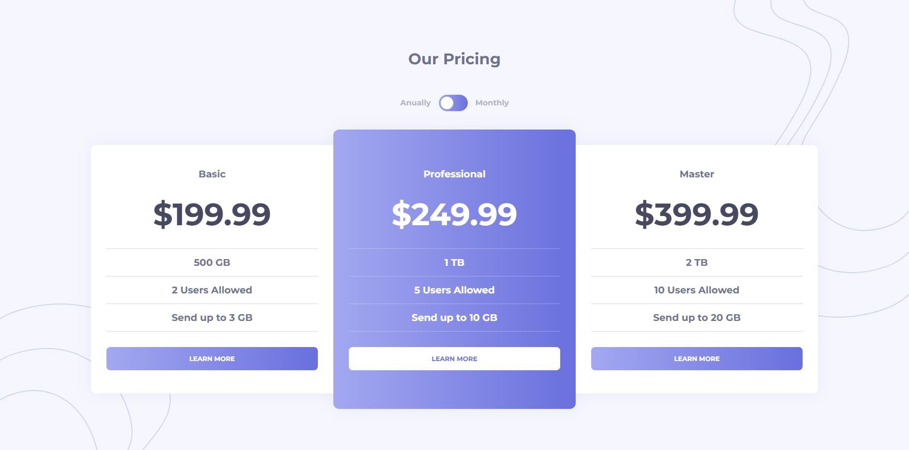

# Frontend Mentor - Pricing component with toggle solution

This is a solution to the [Pricing component with toggle challenge on Frontend Mentor](https://www.frontendmentor.io/challenges/pricing-component-with-toggle-8vPwRMIC). Frontend Mentor challenges help you improve your coding skills by building realistic projects. 

## Table of contents

- [Overview](#overview)
  - [The challenge](#the-challenge)
  - [Screenshot](#screenshot)
  - [Links](#links)
- [My process](#my-process)
  - [Built with](#built-with)
  - [Useful resources](#useful-resources)
- [Author](#author)

**Note: Delete this note and update the table of contents based on what sections you keep.**

## Overview

### The challenge

Users should be able to:

- View the optimal layout for the component depending on their device's screen size
- Control the toggle with both their mouse/trackpad and their keyboard
- **Bonus**: Complete the challenge with just HTML and CSS

### Screenshot

### Links

- Solution URL: [Frontend Mentor Solution](https://www.frontendmentor.io/solutions/pricing-component-with-toggle-aUX28v8sGo)
- Live Site URL: [Github Page](https://sir-floppa.github.io/Frontend-Mentor-08-Pricing-Component/)

## My process

### Built with

- Semantic HTML5 markup
- CSS custom properties
- Flexbox
- CSS Grid
- Angular

### Useful resources

- [W3School - How to Create a Toggle Switch](https://www.w3schools.com/howto/howto_css_switch.asp) - This helped me to make the toggle button, it's quite neat.

## Author

- Website - [Nicolás Donoso](https://sir-floppa.github.io)
- Frontend Mentor - [@Sir-Floppa](https://www.frontendmentor.io/profile/Sir-Floppa)
- Instagram - [@sir_floppa](https://www.instagram.com/sir_floppa/)
